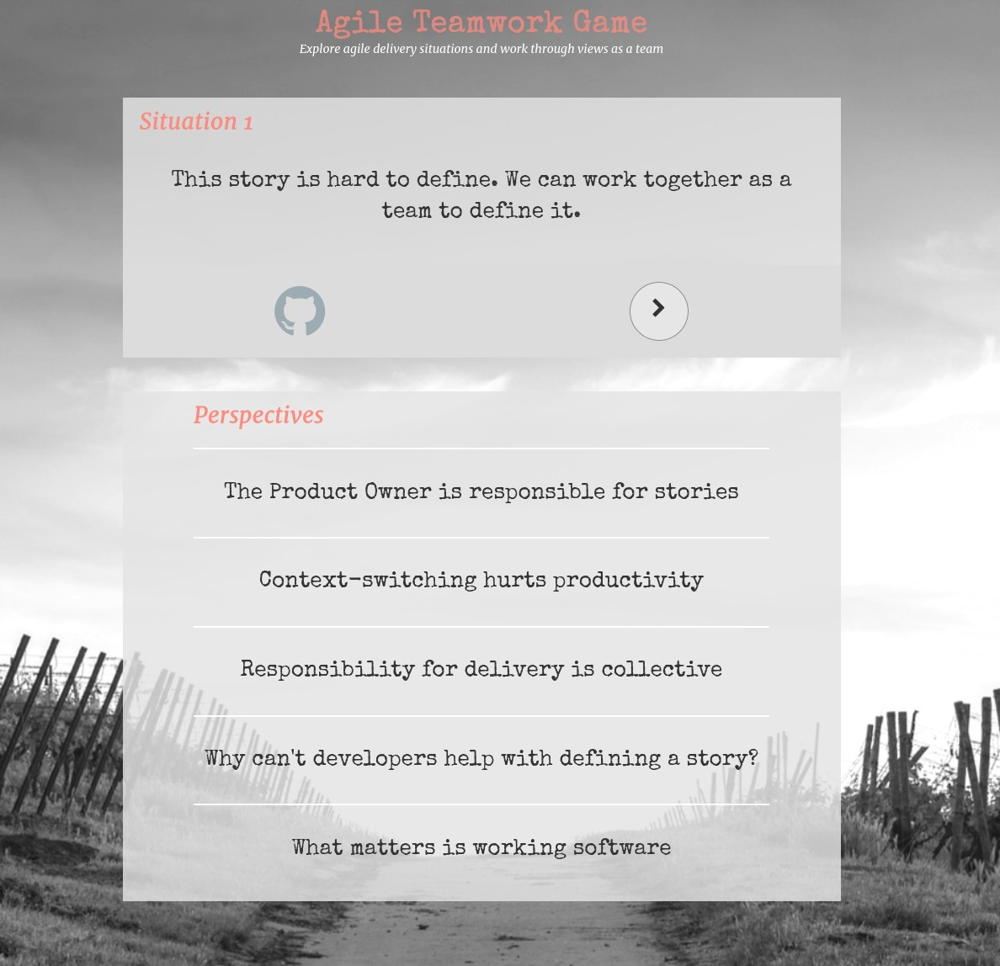
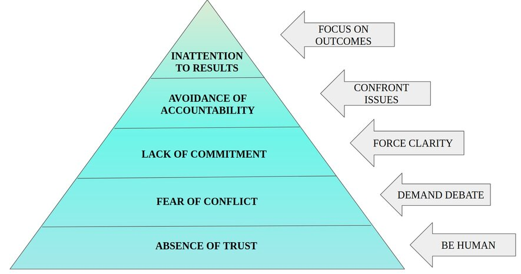

# Agile Teamwork Game

## Motivations

This tool is a way to get practice working through issues as a team. The aims are to encourage healthy conflict and also to challenge flexibility of role boundaries.

Scenarios are deliberately delicate. The idea is help teams get comfortable with acknowledging perspectives and working through disagreements.

## Using the Tool/Game

The situations and perspectives are to stimulate discussion. There are no right answers. The situations are deliberately vague. Different contexts could be imagined around the situations to explore what the team might then do. (For example, consider how attitudes to overtime might change if it were paid a large multiple of a normal hourly rate. Or how frustration at being blocked by another team might change if that team had done favours before.)

If it goes well you could switch to a whiteboard and go through perspectives on real situations the team has faced or is facing.

Access at https://ryandawsonuk.github.io/AgileTeamworkGame/

## When/How to Use

The tool is based on the principles of 'The Five Dysfunctions of a Team' and observations about how Agile teamwork can degenerate (especially into so-called 'Dark Scrum'). 

The tool has similarities to [other exercises based on The Five Dysfunctions](https://buscreative.blogspot.com/2017/03/overcoming-five-dysfunctions-of-team.html), especially those geared towards engaging openly and constructively in disagreements (i.e. not getting personal and acknowledging differences of opinion). But the tool is tailored to an Agile context and will likely trigger reactions where team members see situations through the lens of their role and previous experience.

Building trust in a team is a pre-requisite for safe conflict. It is at the foundation of the Five Dysfunctions pyramid.

The tool is aimed at Fear of Conflict and not Lack of Trust. To use it effectively you need to be able to create a safe space. For teams that show problematic and personalised conflict or for newly-formed teams it may be best to first try to build rapport with safer team-building exercises or games.

Either bookmark [the url](https://ryandawsonuk.github.io/AgileTeamworkGame/) or fork it and configure GitHub Pages for your fork under Settings, with no theme and from master.

With a fork you can change script.js to whatever you find most helpful. Also feel free to submit suggestions here or [contact me on twitter](https://twitter.com/ryandawsongb).

## Credits

The design is based on the [RandomQuoteMachine](https://github.com/gminovska/RandomQuoteMachine) by [Gordana Minovska](https://github.com/gminovska). Read more about the making of that [on medium](https://medium.com/@allsavant/how-i-made-random-quote-machine-dd2933360c95) 

Image by [Pexels](https://pixabay.com/users/Pexels-2286921/?utm_source=link-attribution&amp;utm_medium=referral&amp;utm_campaign=image&amp;utm_content=1835847) from [Pixabay](https://pixabay.com/?utm_source=link-attribution&amp;utm_medium=referral&amp;utm_campaign=image&amp;utm_content=1835847)
